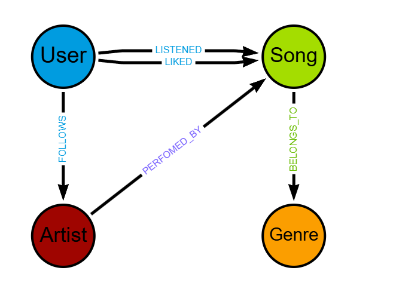

# 🎵 Music Graph Recommendation System
Este projeto implementa um sistema de recomendação de músicas utilizando o banco de dados orientado a grafos Neo4j. O objetivo é ir além das buscas simples e identificar padrões de consumo musical através das conexões entre usuários, faixas, artistas e gêneros.

## 🚀 Visão Geral
Diferente de sistemas convencionais, este modelo utiliza a linguagem Cypher para mapear o comportamento do usuário (escutar, curtir, seguir) e gerar sugestões baseadas em proximidade e interesses compartilhados.

## 🏗️ Modelagem de Dados

### Entidades (Nós)

- User: Representa o ouvinte no sistema.
- Song: Faixas individuais disponíveis para streaming.
- Artist: Músicos, bandas ou compositores.
- Genre: Categorias musicais (Pop, Rock, Jazz, etc.).

### Interações (Arestas/Relacionamentos)

- LISTENED: Conecta um usuário a uma música, contendo a propriedade play_count (frequência).
- LIKED: Indica que o usuário favoritou uma música específica.
- FOLLOWS: Relacionamento de interesse entre um usuário e um artista.
- PERFORMED_BY: Vincula a música ao seu respectivo artista.
- BELONGS_TO: Classifica a música em um ou mais gêneros.




## 🛠️ Funcionalidades do Script Cypher

O script disponibilizado realiza as seguintes operações:
- Constraints: Garante a integridade dos dados através de restrições de unicidade para IDs e nomes.
- População: Cria um ecossistema com múltiplos artistas, músicas e gêneros.
- Simulação de Usuários: Gera perfis de usuários com diferentes históricos de escuta e preferências.
- Interações Dinâmicas: Estabelece conexões de "curtidas" e "seguidores" para validar as regras de recomendação.

## 🔍 Exemplos de Consultas (Consultas de Recomendação)
1. Filtragem Colaborativa (Social)
Sugere músicas que pessoas com gostos parecidos com os seus estão ouvindo, mas que você ainda não conhece:

```Cypher
MATCH (me:User {id: 101})-[:LISTENED]->(s:Song)<-[:LISTENED]-(others:User)-[:LIKED]->(rec:Song)
WHERE NOT (me)-[:LISTENED]->(rec)
RETURN rec.title AS Musica, count(others) AS Relevancia
ORDER BY Relevancia DESC;
```

2. Descoberta por Artista
Sugere novas faixas de artistas que o usuário já segue:

```Cypher
MATCH (u:User {id: 101})-[:FOLLOWS]->(a:Artist)<-[:PERFORMED_BY]-(s:Song)
WHERE NOT (u)-[:LISTENED]->(s)
RETURN s.title AS Nova_Musica, a.name AS Artista;
```

## 📋 Como Utilizar
Certifique-se de ter o Neo4j Desktop instalado ou uma instância no Neo4j AuraDB.

Execute o script de criação e população (population.cypher).

Utilize as queries de recomendação para testar a inteligência do grafo.