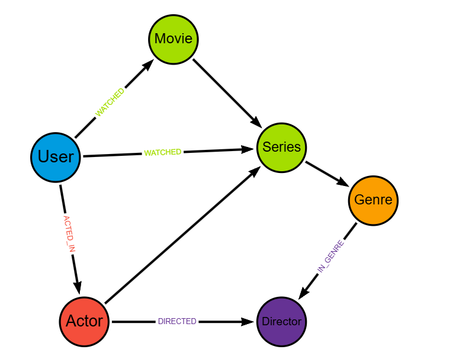

# 🎬 Movie Graph Recommendation System
Este projeto consiste na modelagem e implementação de um Grafo de Conhecimento para um serviço de streaming de filmes e séries. Diferente de bancos de dados relacionais tradicionais, este sistema utiliza Neo4j (Cypher) para conectar usuários, títulos, elenco e diretores, permitindo a criação de um motor de recomendação baseado em relacionamentos complexos.

## 📌 Objetivo
Desenvolver um banco de dados que facilite a descoberta de conteúdo através de conexões como:

Usuários que assistiram aos mesmos filmes.

Filmes do mesmo gênero com diretores em comum.

Atores que participaram tanto de filmes quanto de séries populares.

## 🏗️ Modelo do Grafo
O modelo é composto pelos seguintes componentes:

### Nós (Entities)
User: Representa os usuários da plataforma.

Movie: Longas-metragens.

Series: Conteúdo episódico (séries).

Genre: Categorias (Sci-Fi, Drama, Ação, etc.).

Actor: Elenco.

Director: Cineastas.

### Relacionamentos (Connections)
(:User)-[:WATCHED {rating: 1-5}]->(:Movie/Series)

(:Actor)-[:ACTED_IN]->(:Movie/Series)

(:Director)-[:DIRECTED]->(:Movie/Series)

(:Movie/Series)-[:IN_GENRE]->(:Genre)

## 🚀 Como Executar
Pré-requisitos
Neo4j Desktop ou Neo4j AuraDB (instância na nuvem).

Browser do Neo4j para execução dos comandos.

Instalação
Copie o conteúdo do arquivo script.cypher disponível neste repositório.

Cole no console do Neo4j.

Execute o comando para criar as constraints, os nós e os relacionamentos.

## 📊 Consultas de Exemplo (DQL)
Após popular o banco, você pode testar o sistema de recomendação com as seguintes queries:

1. Recomendar por "Quem assistiu este, também viu"
Cypher
MATCH (u1:User {id: 1})-[:WATCHED]->(m)<-[:WATCHED]-(u2:User)-[:WATCHED]->(rec)
WHERE NOT (u1)-[:WATCHED]->(rec)
RETURN rec.title, count(*) AS forca_recomendacao
ORDER BY forca_recomendacao DESC LIMIT 5;
2. Buscar títulos por Gênero e Diretor específico
Cypher
MATCH (d:Director {name: 'Christopher Nolan'})-[:DIRECTED]->(m)-[:IN_GENRE]->(g:Genre {name: 'Sci-Fi'})
RETURN m.title, m.year;

## 🛠️ Tecnologias Utilizadas
Neo4j: Banco de Dados Orientado a Grafos.

Cypher: Linguagem de consulta para grafos.