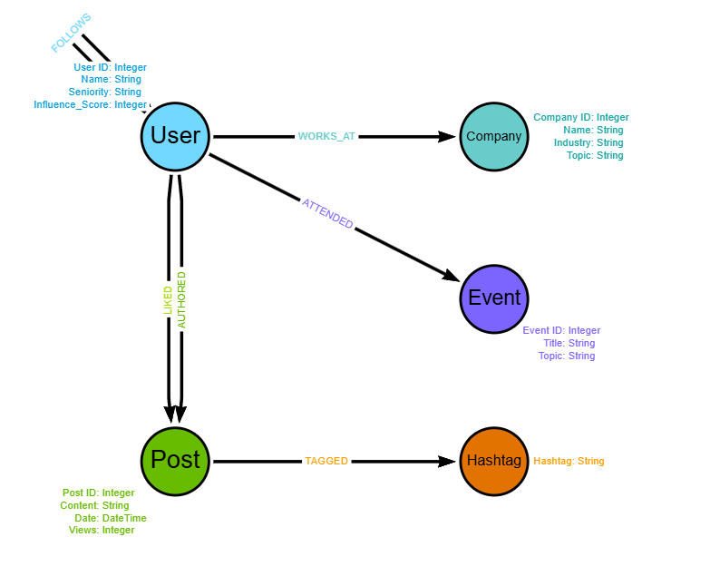

# 🌐 Social Media & Network Analytics - Startup Prototype
Este projeto apresenta um protótipo funcional de um banco de dados orientado a grafos, projetado para uma startup de análise de mídias sociais. O objetivo é fornecer insights profundos sobre engajamento de usuários, influência profissional, conexões corporativas e tendências de mercado através do Neo4j.

## 🎯 Objetivos do Projeto

- Mapear Interações Profissionais: Conectar usuários a empresas e eventos técnicos.
- Identificar Influenciadores: Localizar perfis com alto índice de engajamento e centralidade na rede.
- Análise de Tendências: Rastrear hashtags e tópicos mais discutidos por nichos corporativos.
- Motor de Recomendação: Sugerir conexões de networking baseadas em interesses comuns e "amigos de amigos".

## 🏗️ Arquitetura do Modelo
O sistema utiliza uma estrutura de 50 nós por entidade, garantindo uma densidade de rede realista para testes de estresse e BI.

### Entidades (Nós)
- User: Perfis profissionais com atributos de senioridade e score de influência.
- Company: Organizações de diversos setores (TI, Finanças, Design).
- Post: Conteúdo gerado pelos usuários com métricas de visualização.
- Event: Conferências e workshops que conectam os usuários fora do ambiente digital.
- Hashtag: Termos de categorização para análise de tendências.

### Interações (Relacionamentos)
- WORKS_AT: Vínculo entre profissional e empresa.
- FOLLOWS: Rede de seguidores entre usuários.
- AUTHORED: Autoria de conteúdo.
- LIKED: Engajamento direto (Likes).
- TAGGED: Associação entre posts e hashtags.
- ATTENDED: Participação em eventos.

## Como Implementar

- Requisitos: Possuir o Neo4j Desktop ou uma instância no Neo4j AuraDB instalada.
- Execução: Copie o conteúdo do arquivo social_media_analytics.cypher e execute no console.
- População: O script criará automaticamente as constraints e a massa de dados (250+ nós e centenas de relações).

## Consultas de Inteligência (Insights)
O projeto inclui queries pré-configuradas para responder a perguntas de negócio complexas:

- Top 3 Tendências por Empresa: Identifica quais temas dominam as conversas em cada organização.
- Ranking de Influenciadores: Lista os usuários com maior impacto baseado em curtidas recebidas.
- Networking Preditivo: Sugere novos contatos baseando-se em conexões de segundo grau (amigos de amigos).

## 🛠️ Tecnologias Utilizadas

- Neo4j: Banco de Dados Nativo de Grafos.
- Cypher: Linguagem de consulta declarativa otimizada para grafos.